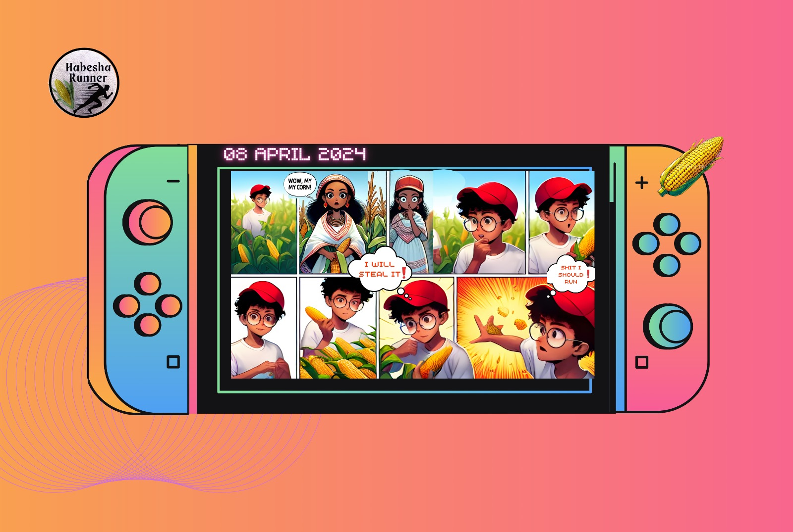

# Habesha Runner - Endless Vertical Runner Game

## Part 1: Description of the Game

**Habesha Runner** is an endless vertical runner game. This game follows the adventurous journey of a kid who steals corn and escapes by running along roads and over cars, with buildings passing by on the sides.

# This is a brief explanation of what the game looks like, its UI and the different components of the game are described thoroughly.

- Here is what the first design of the game looks like:


- A link to the UI and UX design of the game in Figma:
[Figma Design](https://www.figma.com/proto/WrYwej7t72t8Cyn3WmJoqV/Endless-running-(Community)?type=design&node-id=196-16&t=SaTlo6UpSZwg7xKu-0&scaling=scale-down&page-id=0%3A1&starting-point-node-id=46%3A138)

### Gameplay Features
- **Endless Vertical Runner Gameplay**: 
  - Control the character's movement using the left, right, and up arrow keys.
  - Navigate through obstacles and collect coins endlessly.

- **Real-Time Weather Data Integration**:
  - Fetch weather data from an API for San Diego, San Francisco, Asmara, and Dubai.
  - The weather conditions dynamically influence the game environment.

- **Audio Background**:
  - Music and animations change based on the weather, enhancing the immersive experience.
  - Each city features unique music reflecting its cultural ambiance.

- **Immersive Visuals and Audio**:
  - Weather-based animations enhance visuals, creating a dynamic game world.

### Visuals

The game is set across five cities, each with distinct weather setups:

- **San Diego**
- **San Francisco**
- **Asmara**
- **Dubai**
- **Detroit**

### Development and Design
- The city and car models were designed in Blender and exported as `.glb` files.
- Coins are custom shapes created within the program.
- The moving track is an integral part of the game's code, controlling the infinite scrolling effect that keeps the game challenging and engaging.

### Technology
- **Three.js**: We used Three.js, a popular 3D library, to render 3D models and create interactive animations within the game environment. It enables real-time rendering of cityscapes, obstacles, and character movements.

### Animations

- The animations are driven by Three.js and React, which work together to provide smooth and responsive visuals.
- Weather animations, such as rain, clouds, and snow, are dynamically generated based on real-time weather data.
- Character and obstacle movements are animated to provide a fluid and engaging gameplay experience.

### Game Images


## Part 2: How to Test the Game

To test the game, follow these steps to set up the environment:

1. **Clone the Repository**:
   ```bash
   git clone https://github.com/ASD-Are/habesha_runner
   cd habesha_runner
   ```

2. **Install Dependencies**:
   Ensure you have Node.js installed. Then, run:
   ```bash
   npm install
   ```

3. **Run the Game**:
   Start the development server:
   ```bash
   npm run dev
   ```
   Open your web browser and go to `http://localhost:----` to start playing the game.

4. **Navigate Between Cities**:
   Use the city selection menu to choose different cities and experience the game with varying weather conditions.

## Part 3: Explanation of Important Parts of the Code

### Code Structure

The game is structured using React components to handle different parts of the game, such as city environments, weather conditions, and user interface.

#### Key Components
- **`App.jsx`**:
  - Acts as the entry point for the application.
  - Sets up the routing for different city environments and handles navigation between them using `react-router-dom`.
  - Imports paths for city-specific components like `SanFranciscoCloud`, `SanFranciscoDay`, etc.
  - Contains a `<Router>` component that defines routes for each city and other parts of the application.

- **City Components (`SanFranciscoCloud.jsx`, `SanFranciscoDay.jsx`, etc.)**:
  - These components define the environment for each city.
  - They include weather effects, visual elements, and city-specific features.
  - Each component utilizes imported `.glb` files to render 3D models of cities and obstacles.

- **Weather API Integration**:
  - The weather data is fetched using a REST API call.
  - The data influences the game by altering background animations and audio tracks based on real-time weather conditions.
  - For example, a rainy day in San Francisco will display rain animations and play rain-themed music.

- **Animations**:
  - Three.js is used to create and control animations within the game.
  - Animations are triggered by player actions and weather changes, ensuring that visuals are synchronized with gameplay.

- **`index.css` and `App.css`**:
  - These style sheets define the visual layout of the game.
  - Custom styles for the logo, background images, and other UI elements ensure a cohesive look and feel.
  - Styles for responsiveness and interaction effects, like hover states, enhance user engagement.

- **`Home.jsx` and Other Page Components**:
  - Handle the initial user interface, city selection, and navigation.
  - Display buttons and links to start the game and choose different cities.

### Moving Track

The moving track is implemented using a continuous loop that updates the position of obstacles and coins. This creates an endless runner experience by resetting elements as they move off-screen. The track is generated dynamically to ensure that new obstacles and coins appear as the player progresses.

## Authors
This game was developed by:
- [Aron Dagniew](https://github.com/ASD-Are) 
- [Sened Desalegn](https://github.com/Senedaa) 
- [Seim Hagos](https://github.com/siezer-5997)
- [Isaias Kidane]() 


## To Do
- **Project Vision**: Our aim is to provide an entertaining game that also offers a glimpse into different cultures and weather phenomena.
- **Future Enhancements**: We plan to further develop the audio tracks and animations, and add more cultural elements specific to each city to enhance the immersive experience.
